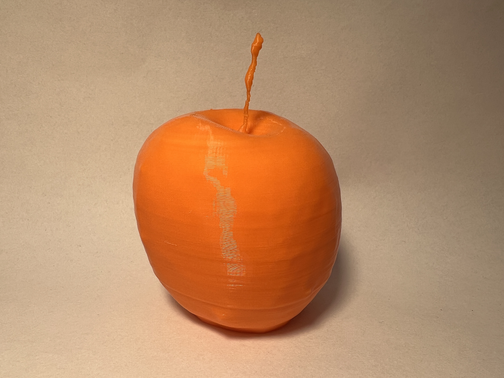

# 3D scan of an apple

I scanned an Apple using the Scaniverse 3D scanner application, tidied up the geometry in Meshmixer and then printed it.

I printed it in eSun PLA+ Orange on an Anycubic Kobra. Wait, does that make it an orange or an apple?

https://www.printables.com/model/376762-a-scan-of-an-apple

# License 

CC0

# Author

Leon Brocard <acme@astray.com>